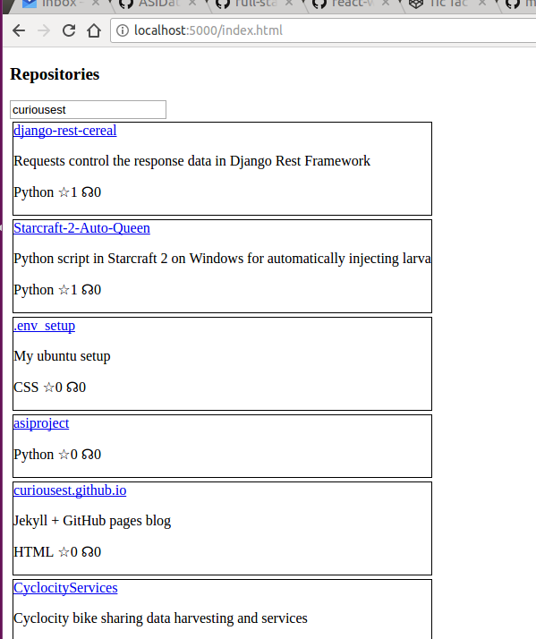

# Setup

* Requires npm and docker-compose and docker installed
* Build: `make build`
* Test: `make test`
* Run: `make run`, browse to (http://localhost:5000/index.html)[http://localhost:5000/index.html]
* Stop: ctrl+c and `docker-compose stop -t0`

# Time to build

* Backend setup, writing unit tests, writing app: ~45min
* Frontend getting react running/building: ~30min
* Frontend writing react: ~2hrs (second time trying react - first time was using react-native: (https://github.com/curiousest/react-explore)[https://github.com/curiousest/react-explore])

# Build next

* Styling is obviously not accurate
* Add a "Get Repositories" button?
* BDD against https://github.com/ASIDataScience/full-stack-engineer-coding-challenge#user-story

